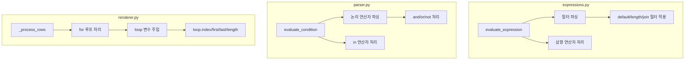

# Jinja2 기능 확장 구현

## 구현 범위

| 번호 | 기능 | 문법 예시 |

|------|------|----------|

| 1 | default 필터 | `{{ value\|default('N/A') }}` |

| 2 | 논리 연산자 | ``, ``, `` |

| 3 | loop 변수 | `{{ loop.index }}`, `{{ loop.first }}`, `{{ loop.last }}`, `{{ loop.length }}` |

| 4 | in 연산자 | `` |

| 5 | length 필터 | `{{ items\|length }}` |

| 6 | join 필터 | `{{ items\|join(',') }}` |

| 7 | 삼항 연산자 | `{{ 'yes' if condition else 'no' }}` |

## 아키텍처



## 구현 계획

### 1. 필터 시스템 추가 ([expressions.py](src/xls_template_renderer/expressions.py))

**새 파일 생성**: `filters.py`

- 필터 함수 정의: `filter_default`, `filter_length`, `filter_join`
- 필터 레지스트리 관리

**expressions.py 수정**:

- `evaluate()` 메서드에서 `|` 파이프 감지
- 필터 체이닝 지원: `value|filter1|filter2`
- 삼항 연산자 `if...else` 파싱 (AST `ast.IfExp` 노드 처리)

### 2. 논리 연산자 추가 ([parser.py](src/xls_template_renderer/parser.py))

**evaluate_condition() 수정**:

- `and`, `or` 키워드 파싱 (괄호 고려)
- `not` 단항 연산자 처리
- `in` 연산자 처리: ``

파싱 우선순위:

1. 괄호 `()` 처리
2. `not` 처리
3. `and` 처리
4. `or` 처리
5. `in` 처리

### 3. loop 변수 추가 ([renderer.py](src/xls_template_renderer/renderer.py))

**LoopContext 클래스 생성**:

```python
class LoopContext:
    def __init__(self, index0, length):
        self.index = index0 + 1  # 1-based
        self.index0 = index0     # 0-based
        self.first = index0 == 0
        self.last = index0 == length - 1
        self.length = length
```

**_process_rows() 수정**:

- for 루프 처리 시 `loop` 변수를 context에 주입
- `{{ loop.index }}`, `{{ loop.first }}` 등 접근 가능

### 4. 테스트 추가 (커버리지 90% 이상 목표)

각 기능별 테스트 케이스:

- `test_filters.py` (신규): default, length, join 필터 + 필터 체이닝 + 에러 케이스
- `test_parser.py`: 논리 연산자(and/or/not), in 연산자 테스트 추가
- `test_renderer.py`: loop 변수(index, first, last, length) 테스트 추가
- `test_expressions.py`: 삼항 연산자 테스트 추가

테스트 범위:

- 정상 케이스 (happy path)
- 엣지 케이스 (빈 값, None, 빈 리스트 등)
- 에러 케이스 (잘못된 문법, 존재하지 않는 필터 등)
- 통합 테스트 (필터 + 루프 + 조건문 조합)

### 5. 커버리지 확인

```bash
pytest --cov=src/xls_template_renderer --cov-report=term-missing
```

목표: 전체 커버리지 90% 이상

### 6. 문서 업데이트

- [README.md](README.md): TODO 항목 체크
- [SYNTAX.md](docs/SYNTAX.md): 새 기능 문법 설명 추가