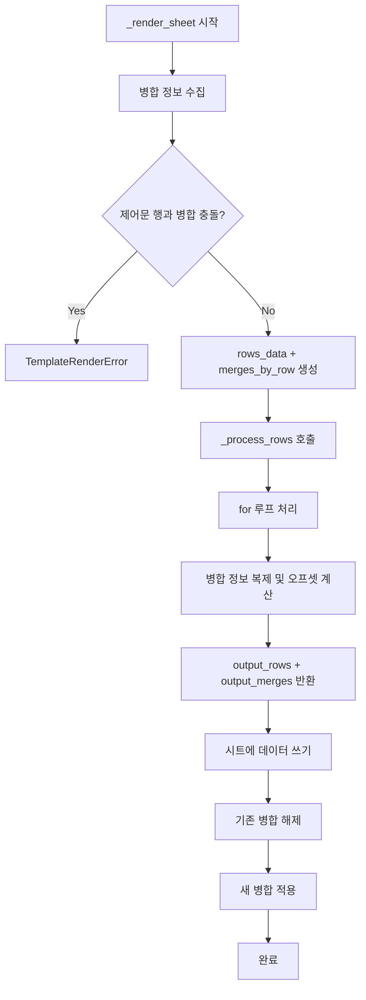

# 병합 셀 지원 추가

## 현재 상태

[renderer.py](src/xlsx_template_renderer/renderer.py) 125-131행에서 병합 셀이 있으면 무조건 에러 발생:

```python
if ws.merged_cells.ranges:
    raise TemplateRenderError("병합 셀은 지원하지 않습니다...")
```

## 구현 전략

### 1. 병합 정보 수집 및 검증

`_render_sheet`에서:

- `ws.merged_cells.ranges`로 병합 정보 수집
- 각 병합 범위가 제어문 행을 포함하는지 검증
  - 제어문 행: ``, ``, ``, `` 등이 있는 행
  - 포함 시 `TemplateRenderError` 발생

### 2. 병합 정보 자료구조

```python
# 병합 정보를 행 인덱스 기준으로 저장
# key: 시작 행 (0-based)
# value: 해당 행에서 시작하는 병합 목록
merges_by_row = {
    0: [  # 1행에서 시작하는 병합들
        {'min_col': 1, 'max_col': 2, 'row_span': 3},  # A1:B3
    ],
    ...
}
```

### 3. _process_rows 수정

함수 시그니처 변경:

```python
def _process_rows(
    rows_data: List[List[dict]], 
    context: Dict[str, Any],
    wb: Optional[Workbook] = None,
    merges_by_row: Optional[Dict[int, List[dict]]] = None  # 추가
) -> Tuple[List[List[dict]], List[dict]]:  # 병합 정보도 반환
```

for 루프 처리 시:

- 루프 본문에 해당하는 병합만 추출
- 각 반복마다 행 오프셋을 더해 새 병합 정보 생성

### 4. 결과 시트에 병합 적용

`_render_sheet` 마지막 단계에서:

```python
# 기존 병합 해제
for merged_range in list(ws.merged_cells.ranges):
    ws.unmerge_cells(str(merged_range))

# 새 병합 적용
for merge in output_merges:
    ws.merge_cells(
        start_row=merge['start_row'],
        end_row=merge['end_row'],
        start_column=merge['start_col'],
        end_column=merge['end_col']
    )
```

## 처리 흐름



## 주요 변경 파일

- [renderer.py](src/xlsx_template_renderer/renderer.py): 핵심 로직 수정
- [test_renderer.py](tests/test_renderer.py): 병합 셀 테스트 추가
- [examples/merged_cells_usage.py](examples/merged_cells_usage.py): 병합 셀 예제 스크립트
- [examples/merged_cells_template.xlsx](examples/merged_cells_template.xlsx): 병합 셀 템플릿 파일
- [docs/SYNTAX.md](docs/SYNTAX.md): 병합 셀 지원 문서 추가

## 테스트 케이스

1. for 루프 내 수직 병합 복제
2. for 루프 내 수평 병합 복제
3. 중첩 for 루프 내 병합
4. 병합 셀 내 변수 치환
5. 제어문 행 병합 시 에러 발생 확인

## 예제 파일 (examples/)

`merged_cells_template.xlsx` 구조:

- A열 2-3행 수직 병합 (카테고리명)
- B-C열 1행 수평 병합 (헤더)
- for 루프로 반복 시 병합도 함께 복제

`merged_cells_usage.py`:

- 템플릿 로드 및 데이터 바인딩 예제
- 결과 파일 생성 및 확인

## 문서 업데이트 (SYNTAX.md)

추가할 내용:

- 병합 셀 지원 섹션
  - for 루프 내 병합 셀 복제 동작 설명
  - 수직/수평 병합 모두 지원
  - 병합 셀 내 변수 치환 가능
- 제한사항
  - 제어문 행을 포함하는 병합은 불가
  - 예: `` 행과 데이터 행을 병합하면 에러
- 예시 템플릿 구조 및 결과