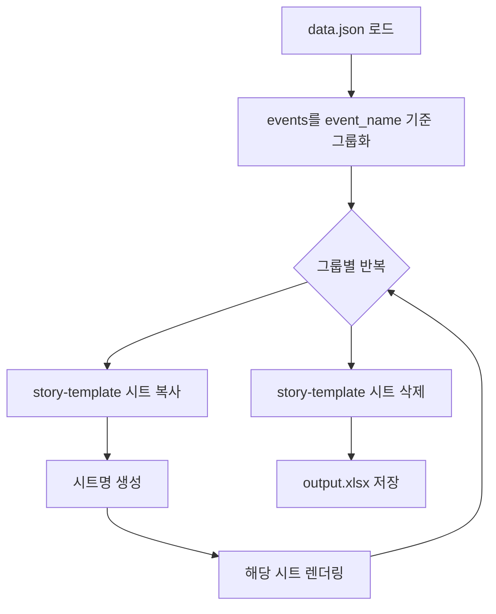

# 이벤트 시트 복사 및 렌더링 스크립트 구현

## 동작 흐름



## 시트명 생성 규칙

- **단일 이벤트**: event_title 그대로 (예: "1부 대면 팬사인회")
- **복합 이벤트**: event_title들 조합 (예: "1부 대면 팬사인회 2부 포토회")

## 구현 파일

### 새로 생성

[use_case/event_sheets/scripts/render_event_sheets.py](use_case/event_sheets/scripts/render_event_sheets.py)

```python
# 핵심 로직
def get_sheet_name(events_group):
    """이벤트 그룹에서 시트명 생성"""
    titles = [e["event_title"] for e in events_group]
    return " ".join(titles)

def render_event_sheets(template_path, data_path, output_path):
    """
    1. data.json 로드
    2. events를 event_name 기준 그룹화
    3. 각 그룹별로:
       - story-template 복사
       - 시트명 설정
       - 해당 시트 렌더링
    4. story-template 삭제
    5. 저장
    """
```

### 수정 파일

- [scripts/run_all.sh](use_case/event_sheets/scripts/run_all.sh): 새 스크립트 호출
- [scripts/run_single.sh](use_case/event_sheets/scripts/run_single.sh): 새 스크립트 호출
- [scripts/verify.py](use_case/event_sheets/scripts/verify.py): 예상 시트명 로직 업데이트

## 예상 결과

| 케이스 | events 구성 | 생성 시트 |

|--------|-------------|-----------|

| 01_fansign_event | 1개 이벤트 | "1부 대면 팬사인회" |

| 12_combo_1_2_and_3 | 1부+2부(같은 event_name), 3부(다름) | "1부 대면 팬사인회 2부 대면 포토회", "3부 영상통화 이벤트" |

| 13_combo_1_2_and_3_4 | 1부+2부, 3부+4부 | "1부 대면 팬사인회 2부 대면 게임회", "3부 영상통화 이벤트 4부 개인 영상통화" |

## 의존성

- openpyxl: 시트 복사용
- xlsx_template_renderer: 렌더링용